Something had been bugging me about BERT for a while, and I couldn't quite place it. Here's a model that we've trained to fill in blanks, give it a sentence with 15% of the tokens masked and it'll predict what goes there. And it's terrifyingly good at that job. But then we just... stopped. We took this model that excels at reconstructing corrupted text and decided it could only ever work at exactly one level of corruption.

What if it could handle 20%? Or 50%? Or 95%? What if you cranked the dial all the way to "every single token is missing" and asked it to reconstruct the whole thing from nothing?

That's text diffusion. And the strange part isn't that it works. The strange part is that the idea was sitting right there inside BERT's training objective the whole time, and nobody turned the knob for years.

## Table of Contents

- [Part 1: Understanding to mask tokens](#part-1-understanding-to-mask-tokens)
- [Part 2: The Model That Learns to Clean Up](#part-2-the-model-that-learns-to-clean-up)
- [Part 3: Solving the Crossword](#part-3-solving-the-crossword)
- [Part 4: Why Autoregressive Still Wins (For Now)](#part-4-why-autoregressive-still-wins-for-now)
- [Part 5: The Thought Someone Forgot to Finish](#part-5-the-thought-someone-forgot-to-finish)
- [TL;DR](#tldr)


## Part 1: Understanding to mask tokens

Let's start with a sentence we'll follow through this entire post: "the cat sat on the mat." Six tokens. Nothing fancy. Now let's destroy it.

My first instinct was that the corruption process must be something clever. Maybe you mask tokens left to right, like drawing a line. Or maybe there's a learned corruption model that figures out which tokens to mask first, some kind of intelligent degradation that preserves structure as long as possible before collapsing into noise.

Nope. It's a coin flip. Per token. All at once.

Each token independently flips a biased coin. Heads: survive. Tails: get replaced with `[MASK]`. At $t = 0$ the coin is almost all-heads (everything survives) and it gets progressively more biased toward tails as time increases, until at $t = T$ it's all-tails and nothing survives. That's the whole corruption process. 

Our sentence "the cat sat on the mat" at, say, 50% corruption might become "the `[MASK]` sat `[MASK]` the `[MASK]`." A different random draw at the same level might give you "`[MASK]` cat `[MASK]` on `[MASK]` mat." Pure chance.

The math is almost very simple. Each token survives with probability $\bar{\alpha}_t$, a number that smoothly decays from 1 to 0 as $t$ goes from 0 to $T$:

$$q(x_t \mid x_0) = \begin{cases} x_0 & \text{with probability } \bar{\alpha}_t \\ \texttt{[MASK]} & \text{with probability } 1 - \bar{\alpha}_t \end{cases}$$

And here's what makes this practical: that closed-form marginal means you can jump straight to ANY corruption level without simulating every intermediate step. Want to see what 73% corruption looks like? Set $\bar{\alpha}_t = 0.27$ and flip your coins. No need to destroy the sentence one step at a time.

But what does that schedule actually look like? A cosine schedule with $T = 1000$ timesteps:

Let's build the noise schedule of a 1D array of survival probabilities that decays from 1.0 to ~0.0.

```python
T = 1000
t = torch.arange(T)
alpha_bar = torch.cos((t / T) * (math.pi / 2)) ** 2  # (T,) — starts at 1.0, ends near 0.0
# alpha_bar[0]   ≈ 1.00  (nothing masked)
# alpha_bar[500] ≈ 0.50  (half masked)
# alpha_bar[999] ≈ 0.00  (everything masked)
```

The cosine shape means corruption is gentle early (tokens survive longer) and accelerates toward the end. The choice of schedule shape (cosine vs. linear vs. sqrt) affects training, cosine is popular because it keeps text partially readable across more timesteps, giving the model useful signal to learn from.

Now lets look at the corruption function itself:

Given a batch of token sequences and timesteps, corrupt each sequence by independently masking tokens according to the noise schedule.

```python
def q_sample(x0, t, alpha_bar, mask_id=103):
    # x0:        (B, L) token ids
    # t:         (B,)   timesteps, each in [0, T)
    # alpha_bar: (T,)   precomputed noise schedule — alpha_bar[t] is the
    #            survival probability at timestep t (1.0 at t=0, ~0.0 at t=T)
    keep_prob = alpha_bar[t][:, None].expand_as(x0)  # (B, L)
    keep = torch.bernoulli(keep_prob).bool()
    xt = x0.clone()
    xt[~keep] = mask_id
    masked_positions = ~keep
    return xt, masked_positions
```

`xt` is the corrupted batch (same shape as `x0`), and `masked_positions` tells you which tokens got replaced. Feed it "the cat sat on the mat" at a high timestep and you'll get back mostly blanks.


## Part 2: The Model That Learns to Clean Up

So we've got our corrupted sentence: "the `[MASK]` sat `[MASK]` the `[MASK]`" and now we need a model that looks at this mess and predicts what the missing pieces are. The model sees both sides of each blank (bidirectional, think BERT architecture, not GPT) and outputs a probability distribution over the vocabulary at every masked position.

There's a subtlety that seems minor but changes everything: we tell the model which corruption level it's looking at. A sinusoidal embedding of the timestep $t$ gets added to the token embeddings before the Transformer processes anything. You know that feeling when someone hands you a half-finished jigsaw puzzle but doesn't tell you how many pieces are missing? You'd solve it completely differently if 3 pieces were gone versus 90. Same idea. At 5% masked, the model is copy-editing, filling in an obvious word from rich context. At 95% masked, it's generating from almost nothing. Those are fundamentally different jobs hiding behind the same loss function.

The loss itself is [cross-entropy](/_posts/2026/2026-02-26-cross-entropy-likelihood.md), but only at positions that were actually masked. No point making the model predict tokens it can already see:

$$\mathcal{L}(\theta) = \mathbb{E}_{t, x_0, x_t} \left[ - \sum_{i:\, x_t^i = \texttt{[MASK]}} \log p_\theta(x_0^i \mid x_t, t) \right]$$

For our running example: the model sees "the `[MASK]` sat `[MASK]` the `[MASK]`" with $t$ indicating 50% corruption, and it needs to assign high probability to "cat" at position 2, "on" at position 4, and "mat" at position 6. The cross-entropy loss penalizes it for any probability mass it puts elsewhere.

Let's walk through just one training step: sample timesteps, corrupt the batch, run the model, compute loss only at masked positions, backprop.

```python
def train_step(model, optimizer, x0, alpha_bar, mask_id=103):
    B = x0.shape[0]
    t = torch.randint(1, len(alpha_bar), (B,), device=x0.device)

    xt, masked = q_sample(x0, t, alpha_bar, mask_id)
    logits = model(xt, t)          # (B, L, vocab_size)

    loss = F.cross_entropy(
        logits[masked],             # (N_masked, vocab_size)
        x0[masked]                  # (N_masked,)
    )

    optimizer.zero_grad()
    loss.backward()
    torch.nn.utils.clip_grad_norm_(model.parameters(), 1.0)
    optimizer.step()
    return loss.item()
```

We expect to see a scalar loss value that decreases over training as the model gets better at predicting masked tokens across all noise levels. This way we are sure that the model learns to denoise at every corruption level simultaneously, from trivial fill-in-the-blank all the way to generating entire sentences from nothing.

Now, if you've been reading carefully, something might be nagging at you. A bidirectional Transformer. Trained to predict masked tokens. Using cross-entropy loss. Where the mask rate is a parameter.

This is **masked language modeling**. This is what BERT does.

The only difference **the ONLY one** is that BERT fixes the mask rate at 15% and calls it a day. Text diffusion says: what if we didn't stop there? What if the model trained on 1% masking AND 15% AND 50% AND 99%, all in the same training run, with the timestep embedding telling it which regime it's in?

One hyperparameter. That's the gap between "pretraining objective" and "generative model."


## Part 3: Solving the Crossword

Here's where we actually generate text, and this is the part where the running example shifts meaning. In Parts 1 and 2, we corrupted and trained on "the cat sat on the mat." But generation doesn't reconstruct a known sentence, it produces a NEW one from scratch. The model starts from pure void and builds whatever its learned distribution suggests. Let's understand the flow of generation:

But how does the model decide WHICH tokens to reveal at each step? There's no fixed confidence threshold — instead, the noise schedule determines *how many* tokens to unmask this step (a count, not a cutoff), and the model's confidence determines *which ones*.

Step 1: the model sees "`[MASK]` `[MASK]` `[MASK]` `[MASK]` `[MASK]` `[MASK]`", six blanks. It produces probability distributions for each position. Maybe it's 83% confident position 1 should be "the" and 71% confident position 3 should be "sat," but only 30% confident about position 6. The schedule says "unmask 2 tokens this round," so it picks the top 2 by confidence, "the" and "sat." Everything else stays masked.

Step 2: now it sees "the `[MASK]` sat `[MASK]` `[MASK]` `[MASK]`." With "the" and "sat" locked in, "on" at position 4 becomes likely, 89% confidence. It commits "on" and maybe "the" at position 5.

Step 3: "the `[MASK]` sat on the `[MASK]`." Now the remaining blanks have enough scaffolding. Maybe it produces "cat" and "mat." Maybe "dog" and "floor." Each generation is different, the model samples from its distribution, not from a target.

Three passes. Six tokens. An autoregressive model would need six forward passes, one per token, strictly left to right, each one committed permanently. This needed three, and it filled in easy tokens first regardless of position.

Lets understand how can generation loop can look like in code:

```python
@torch.no_grad()
def generate(model, alpha_bar, n_samples=8, seq_len=64,
             mask_id=103, cls_id=101, sep_id=102,
             n_steps=50, device='cpu'):
    xt = torch.full((n_samples, seq_len), mask_id,
                    dtype=torch.long, device=device)
    xt[:, 0] = cls_id; xt[:, -1] = sep_id

    timesteps = torch.linspace(len(alpha_bar) - 1, 1, n_steps).long()

    for i, t_val in enumerate(timesteps):
        t_batch = torch.full((n_samples,), t_val.item(),
                             dtype=torch.long, device=device)
        alpha_t    = alpha_bar[t_val].item()
        alpha_prev = alpha_bar[timesteps[i+1]].item() if i+1 < len(timesteps) else 1.0

        probs = F.softmax(model(xt, t_batch), dim=-1)

        is_masked = (xt == mask_id)
        frac = max(0.0, alpha_prev - alpha_t)
        n_unmask = max(1, int(is_masked.sum().item() * frac))

        confidence = probs[is_masked].max(dim=-1).values
        top_idx = confidence.topk(min(n_unmask, len(confidence))).indices
        sampled = torch.multinomial(probs[is_masked], 1).squeeze(-1)
        flat = xt[is_masked]; flat[top_idx] = sampled[top_idx]
        xt[is_masked] = flat

    return xt
```

This generates text in parallel i.e. multiple tokens per step and fills in easy tokens first regardless of position, unlike autoregressive models that are locked to left-to-right order.

```mermaid
%%{init: {
  'theme': 'base',
  'themeVariables': {
    'primaryColor': '#FFFFFF',
    'primaryTextColor': '#1F2937',
    'primaryBorderColor': '#9CA3AF',
    'lineColor': '#6B7280',
    'fontSize': '14px',
    'fontFamily': 'system-ui, -apple-system, sans-serif'
  }
}}%%

flowchart LR
    A["_ _ _ _ _ _"] -->|"confident"| B["the _ sat _ _ _"]
    B -->|"context"| C["the _ sat on the _"]
    C -->|"sample"| D["the ??? sat on the ???"]

    style A fill:#FFFFFF,stroke:#9CA3AF,stroke-width:2px,color:#1F2937
    style B fill:#FFFFFF,stroke:#9CA3AF,stroke-width:2px,color:#1F2937
    style C fill:#FFFFFF,stroke:#9CA3AF,stroke-width:2px,color:#1F2937
    style D fill:#FFFFFF,stroke:#9CA3AF,stroke-width:2px,color:#1F2937
```

<div style="background-color: #F9FAFB; border: 2px solid #D1D5DB; border-radius: 8px; padding: 10px; margin: 20px 0; position: relative;">



<div style="text-align: center; color: #9CA3AF; font-size: 11px; margin-top: 8px;">© FloatingBytes | saraswatmks.github.io</div>

</div>


## Part 4: Why Autoregressive Still Wins (For Now)

So if diffusion can generate multiple tokens per step and fill in blanks from both directions, why isn't everyone using it? 

I think there are three aspects we have to understand, and they're all worth understanding because they display something deep about language itself.

**First: language is ruthlessly sequential.** "The cat sat on the" constrains what comes next in a way that images don't. In an image, knowing the top-left pixel tells you almost nothing about the bottom-right one. Autoregressive models exploit this perfectly, the chain rule factorization $p(x) = p(x_1) \cdot p(x_2|x_1) \cdot p(x_3|x_1,x_2) \cdots$ is the exact probability of the sequence. No approximation. 

**Second: training signal density.** An autoregressive model gets a useful gradient at every single position in every single training example. Every token is a prediction target. A diffusion model only gets signal at masked positions, and the quality of that signal varies wildly, at 5% corruption the task is trivial, at 95% corruption it's almost random guessing. The model spends significant capacity learning to handle noise levels where the learning signal is weak. AR models waste nothing.

**Third: ten years of engineering.** KV caching, speculative decoding, quantization, custom hardware — autoregressive generation has had billions of dollars of optimization poured into making it fast and reliable. Text diffusion is where image diffusion was around 2019: the core idea works, the engineering hasn't caught up. This isn't a fundamental limitation, but it's a real one right now.

Where diffusion does have a structural edge is constrained generation, fill in a paragraph where you know the beginning AND the end, rewrite a middle section, complete text with constraints on both sides. Autoregressive models can only condition on the left. Diffusion conditions on everything that's already been revealed, wherever it sits. For that specific job, the architecture is genuinely better suited.

## Final Notes

In this post, we learned about the how BERT's masked language modeling is half way through the full fledged text diffusion approach.

We saw that text diffusion generates language by reversing a destruction process: corrupt a sentence with random coin-flip masking across a noise schedule, train a bidirectional Transformer to predict the original tokens at every corruption level (which is BERT's MLM generalized from 15% to 0-100%), then generate by starting from all-mask and iteratively revealing the most confident predictions.

Autoregressive models still win on open-ended generation because language is deeply sequential and the chain rule gives them exact likelihoods, but diffusion has a structural edge for constrained/bidirectional tasks.

Did you find this post useful? I am curious to hear from you in comments below.